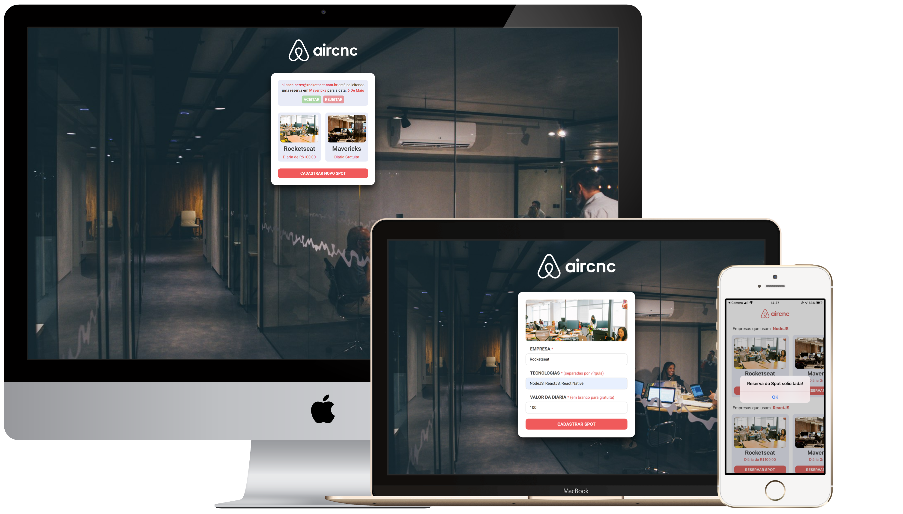

___

    

     

    
    
        
    
    
        
        

     

    <a href="#dart-sobre">Sobre</a>&nbsp;&nbsp;&nbsp;|&nbsp;&nbsp;&nbsp;
    <a href="#battery-tecnologias">Tecnologias</a>&nbsp;&nbsp;&nbsp;|&nbsp;&nbsp;&nbsp;
    <a href="#electric_plug-execute">Execute</a>&nbsp;&nbsp;&nbsp;|&nbsp;&nbsp;&nbsp;
    <a href="#fuelpump-autor">Autor</a>&nbsp;&nbsp;&nbsp;|&nbsp;&nbsp;&nbsp;
    <a href="#memo-licença">Licença</a>

     

  

## :dart: Sobre
A **AirCnC** é uma Aplicação que visa conectar empresas que querem abrir spots e desenvolvedores que procuram um lugar para trocar ideias com outros devs, conhecer a empresa e trabalhar lá por um período.

## :battery: Tecnologias
Essa Aplicação foi desenvolvida utilizando as seguintes tecnologias:

- <a href="https://insomnia.rest/">Insomnia</a>
- <a href="https://mongodb.com/">Mongo DB</a>
- <a href="https://nodejs.org/">NodeJS</a>
- <a href="https://socket.io/">Socket IO</a>
- <a href="https://reactjs.org/">ReactJS</a>
- <a href="https://axios-http.com/">Axios</a>
- <a href="https://expo.dev/">Expo IO</a>
- <a href="https://reactnative.dev/">React Native</a>

## :electric_plug: Execute

	- Clonar o Repositório;
    - Instalar as Dependências do Back-End com o Comando: "npm install";
        |- "./backend/src/server.js:13" - Verificar URL de conexão com o MongoDB;
        |- "./backend/src/models/Spot.js:15" - Atualizar o endereço para as Imagens do SpotSchema;
            >_ Inicializar o Back-End com o Comando: "npm run dev";
    - Instalar as Dependências do Front-End com o Comando: "npm install";
        |- "./frontend/src/Pages/Dashboard/index.js:11" - Atualizar o endereço de conexão dos WebSockets;
        |- "./frontend/src/services/api.js:3" - Alterar o endereço de conexão do Front-End;
            >_ Inicializar o Front-End com o Comando: "npm start";
    - Instalar as Dependências do Mobile com o Comando: "npm install --force";
        |- "./mobile/src/pages/List.js:12" - Atualizar o endereço de conexão dos WebSockets;
        |- "./mobile/src/services/api.js:3" - Alterar o Endereço de Conexão do Mobile;
            >_ Inicializar o Mobile com o Comando: "expo start".

## :fuelpump: Autor

Projeto desenvolvido durante a **Semana OmniStack 9** da <a href="https://rocketseat.com.br/">Rocketseat</a>, ocorrida em **Outubro de 2019**;

Acesse  <a href="https://github.com/rocketseat-education/semana-omnistack-9">aqui</a> o **repositório oficial** da aplicação.

## :memo: Licença

Esse projeto está sob a **Licença MIT**. Veja o arquivo [LICENSE](https://github.com/alissonpratesperes/aircnc/blob/main/LICENSE) para mais detalhes.

___

<h5 align="center">👨🏻‍💻&nbsp;com&nbsp;💜&nbsp;por&nbsp;<a href="https://github.com/alissonpratesperes">Alisson Prates Peres</a>&nbsp;✌🏻😗</h5>